 

<h3><code>Mobin@bioinformatics ~ $ whoami</code></h3>

<table>
  <tr>
    <td valign="top"></td>
    <td valign="top"></td>
  </tr>
</table>

  

<h3><code>Mobin@bioinformatics ~ $ ./run_mass_spec.sh --peptide LVNELTEFAK --continuous-scan</code></h3>

 

<h3><code>Mobin@bioinformatics ~ $ ls ./links</code></h3>

<a href="https://scholar.google.com/citations?hl=en&amp;user=VrgHt9UAAAAJ">google scholar</a> &nbsp;&#183;&nbsp;
<a href="https://www.researchgate.net/profile/Mobin-Pourvali">researchgate</a> &nbsp;&#183;&nbsp;
<a href="https://www.linkedin.com/in/mobin-pourvali/">linkedin</a> &nbsp;&#183;&nbsp;
<a href="mailto:mobin.pourvali@studenti.unimi.it">email</a>

  

<h3><code>Mobin@bioinformatics ~ $ ./contributions.sh</code></h3>

  

<code>the heatmap refreshes daily via GitHub Actions &#183; everything here is a generated SVG</code>

